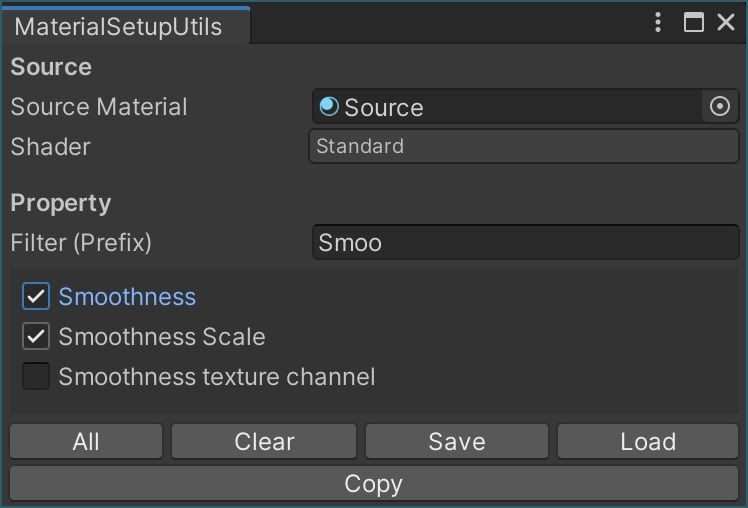

# MaterialSetupUtils

ソースとして指定したマテリアルの設定を取得し、複数のマテリアルに対して一括で適用するツール（エディタ拡張）です。

## 導入方法

1. [Booth](https://yokra.booth.pm/) もしくは [GitHub](https://github.com/yokra9/MaterialSetupUtils/releases) から取得した Zip ファイルを展開 (解凍) します。
2. `.unitypackage` ファイルを、Assets にドラッグ&ドロップします。

## 使い方

1. メニューバーで `[Tools]` - `[MaterialSetupUtils]` を開きます。

   

2. `Source Material` としてパラメータをコピーしたいマテリアルを指定します。

   

3. コピーしたいシェーダプロパティにチェックを入れます。`Filter (Prefix)` でプロパティをフィルタできます（前方一致、大文字と小文字を区別）。また、画面下部でチェックの一括設定やで保存・読込ができます。

   

4. Assets でコピー対象のマテリアルを選択します（複数選択可）。このとき、検索機能で対象を絞り込んだり、`★`で検索条件を保存しておくと便利です。

   

5. 画面下部の `Copy` を押下すると、選択中のマテリアルに対してプロパティのコピー処理が実行されます。

## 不具合報告

[GitHub の Issue](https://github.com/yokra9/MaterialSetupUtils/issues) もしくは [私の Twitter アカウント](https://twitter.com/yokra9)までお気軽にご連絡ください。

## ライセンス

このプログラムには MIT ライセンスが適用されます。
